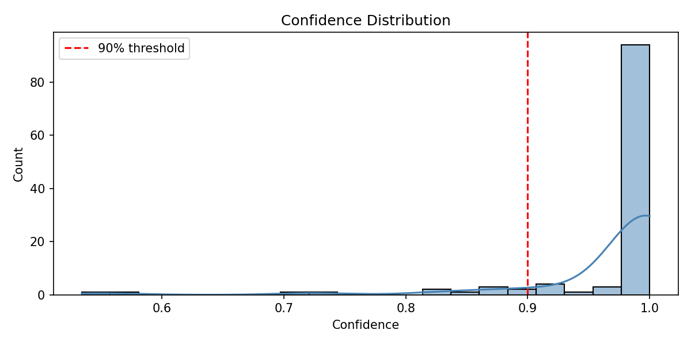
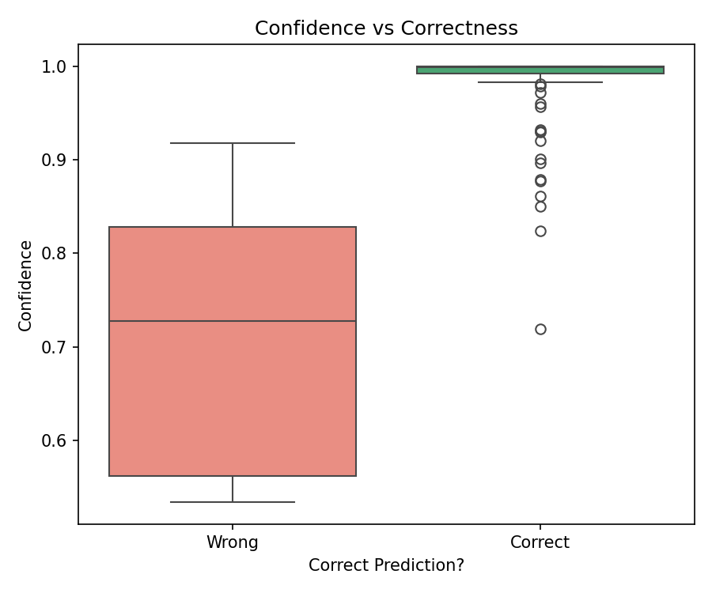
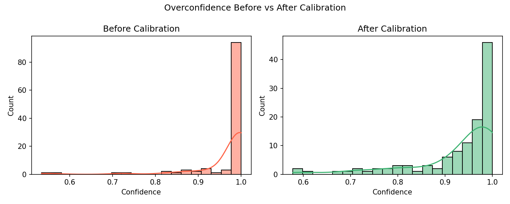

# When My Model Lies: Detecting Overconfident Errors in ML

> A machine learning safety analysis exposing cases where models are **confidently wrong** — and how to fix it.

---

## The Problem

Machine learning models don't just make predictions — they assign confidence scores to those predictions. The danger isn't when a model says *"I'm 60% sure"* and gets it wrong. The danger is when a model says *"I'm 99% sure"* and gets it wrong.

In high-stakes domains like **medical diagnosis**, a confidently wrong prediction isn't just an error — it's a risk to human life. This project investigates exactly that failure mode using breast cancer classification as a case study.

---

## Dataset

**Breast Cancer Wisconsin Dataset** (via `sklearn`)

| Property | Value |
|---|---|
| Task | Binary Classification |
| Classes | Malignant / Benign |
| Total samples | 569 |
| Features | 30 (cell nucleus measurements) |
| Train / Test split | 455 / 114 (80/20) |

---

## Approach

1. Train a **Logistic Regression** model on the dataset
2. Extract **confidence scores** (`predict_proba`) for all test predictions
3. Identify **confidently wrong** predictions — cases where confidence > 90% but the prediction was incorrect
4. Apply **Platt Scaling calibration** to correct overconfidence
5. Compare confidence distributions before and after calibration

---

## Key Results

| Metric | Value |
|---|---|
| Total test predictions | 114 |
| Total wrong predictions | 5 |
| Accuracy | 95.6% |
| **Confidently wrong (>90% confidence)** | **1 (20% of all errors)** |

### The Critical Case

```
Sample 112 → True label: Malignant | Predicted: Benign | Confidence: 91.8%
```

The model predicted a **malignant tumor as benign** with **91.8% confidence**. In a real clinical setting, this patient could be sent home without treatment.

---

## Visualizations

### 1. Confidence Distribution
Most predictions cluster near 1.0 — the model is almost always extremely confident, leaving little room to flag uncertain cases.



### 2. Confidence vs Correctness
Wrong predictions were made with confidence as high as **92%** — nearly indistinguishable from correct predictions in terms of how sure the model appeared.



### 3. Before vs After Calibration
Before calibration, confidence scores pile up near 1.0. After applying **Platt Scaling** (sigmoid calibration with 5-fold cross-validation), scores spread out more honestly across the probability range — reflecting genuine uncertainty where it exists.



---

## How Calibration Works

Raw logistic regression outputs extreme probabilities because it passes large logit values through a sigmoid function. **Platt Scaling** trains a second small model on top of the original:

```
calibrated_probability = sigmoid(A × raw_score + B)
```

Where `A` and `B` are learned to make confidence scores better reflect real-world accuracy. If the model was overconfident, `A` becomes a small number that compresses extreme scores toward the center — producing more honest uncertainty estimates.

---

## Tech Stack

| Tool | Purpose |
|---|---|
| `scikit-learn` | Model training, calibration |
| `pandas` | Data manipulation |
| `seaborn` / `matplotlib` | Visualizations |
| `sklearn.calibration` | Platt Scaling (CalibratedClassifierCV) |

---

## Project Structure

```
overconfidence-analysis/
├── analysis.ipynb        ← full analysis notebook
├── outputs/
│   ├── confidence_distribution.png
│   ├── confidence_vs_correctness.png
│   └── calibration_comparison.png
├── README.md
└── .gitignore
```

---

## How to Run

```bash
git clone https://github.com/nigarj/ai-safety-research.git
cd ai-safety-research/overconfidence-analysis
python3 -m venv venv
source venv/bin/activate
pip install scikit-learn pandas seaborn matplotlib notebook
jupyter notebook analysis.ipynb
```

---

## Future Work

- Compare Logistic Regression vs Random Forest overconfidence behavior
- Add **Expected Calibration Error (ECE)** metric for quantitative calibration measurement
- Build a **risk flagging system**: automatically surface predictions where confidence > 90% for human review
- Extend to multi-class classification problems
- Test on imbalanced datasets where overconfidence is more dangerous

---

## Key Takeaway

> A 95.6% accurate model sounds impressive. But when 1 in 5 of its errors comes with 90%+ confidence, accuracy alone is not enough. In safety-critical systems, **knowing what you don't know** matters as much as being right.

---

*Part of the [AI Safety Research](https://github.com/nigarj/ai-safety-research) portfolio.*